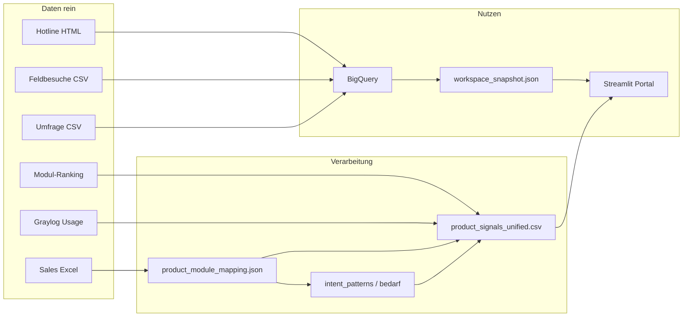

# PM Tool — Kurz-Guide (Stand Juli 2026)

Du hast **zwei Ebenen**, die zusammen gehören, aber unterschiedlich bedient werden:

| Ebene | Wofür? | Wo? |
|-------|--------|-----|
| **Portal** | Dashboard, Chat, Strategie — für PM im Alltag | `Start_Portal.bat` → Streamlit |
| **Pipeline & Exporte** | Daten einlesen, Signale berechnen, Review-CSVs | Kommandozeile / Skripte |

Gemeinsame Achse für fast alles: **`mapping_id`** aus `data/product_module_mapping.json` (= ein RIWA-Produkt, z. B. `modul_verkehr`, `modul_baeume`, `rgz_basic`).

---

## 1. Das Big Picture (30 Sekunden)



**Kernidee:** Kunden sagen etwas (**Say**), fühlen sich wohl/unwohl (**Feel**), nutzen etwas (**Do**), zahlen dafür (**Pay**). Das Tool bündelt das pro Produkt — nicht pro Ticket-Ordner und nicht pro CSV-Spalte.

---

## 2. Portal starten & Sidebar

```powershell
Start_Portal.bat
# oder: streamlit run "PM Evidence AI Portal\Home.py"
```

### Sidebar (links)

| Element | Bedeutung |
|---------|-----------|
| **BigQuery ✅/❌** | Live-Zugriff auf Evidenz (`gcp-key.json`) |
| **Evidenz aus BQ laden** | Snapshot neu aus BigQuery bauen (langsamer, aktuell) |
| **Quellen-Checkboxen** | Welche Signale in Übersicht & Chat einfließen |
| **Pipeline starten** | Rohdaten → verarbeiten → BigQuery → RAG-Index |
| **Daten ablegen** | Pfade für HTML, Umfragen, Feldbesuche |

**Wichtig:** Beim normalen Öffnen lädt das Portal den **Snapshot von Disk** (`data/workspace_snapshot.json`) — deshalb startet es schnell. Nach neuen Dateien: **Pipeline starten**, dann ggf. **Evidenz aus BQ laden**.

---

## 3. Die vier Tabs

### 📊 Übersicht

| Block | Was du siehst | PM-Nutzen |
|-------|---------------|-----------|
| **Produktlinien** | Module, Apps, Plattform, Pakete | Nicht alles ist «Modul» — Apps (KartenApp, Baumkontroll) separat |
| **Themen-Vergleich** | How-To, Defekt, Login … über Quellen | Gleiches Thema in Hotline vs. Umfrage? |
| **Top Pain Points** | Häufigste Cluster/Tickets | Wo brennt es? |
| **Priorität: Umsatz × Ticket-Last** | ERP + Hotline gematcht | **Was zuerst angehen** (viel Umsatz + viele Tickets) |
| **Intent pro Modul** | Bedarf-Typ + Ticket-Routing | PM-Sprache: Feature Request, UX-Kritik, Bug … |
| **Intent pro Business-Gruppe** | ERP-Rahmen (Verkehr, Bau, …) | Portfolio-Sicht |
| **Hotline-Top / Strategie** | Kurzfassung | Schneller Überblick |

**Zwei Intent-Begriffe nicht verwechseln:**

| Begriff | Quelle | Bedeutung |
|---------|--------|-----------|
| **Bedarf-Typ** | Regel-Classifier (`bedarf`) | PM-Hauptkategorie — **primär bei Feldbesuchen** |
| **Ticket-Routing** | Hotline `intent` | How-To, Defekt, Installation … — **nur Hotline** |

Bei Feldbesuchen steht «Ticket-Routing» oft auf **Sonstiges** — das ist ok. Entscheidend ist **Bedarf-Typ**.

### 💬 Assistent

Hybrid-Chat: strukturierte BigQuery-Zahlen + semantische Textsuche (RAG). Braucht laufendes **Ollama** + gebauten Index (Pipeline Schritt `rag`).

### 🎯 KI-Strategie

Strategie-Wizard aus Evidenz — optional Cloud-Synthese (nur mit `.env`-Freigabe).

### 🔍 Initiative prüfen

Initiative Challenger — «Lohnt sich Feature X?» gegen Evidenz prüfen.

---

## 4. Daten ablegen (ohne Upload-Dialog)

| Quelle | Ordner | Format |
|--------|--------|--------|
| Hotline-Tickets | `data/Tickets_neu/html/` | HTML (Ordner = Modul/Cluster) |
| Umfragen | `data/inbox/umfragen/` | CSV mit `;` |
| Feldbesuche | `data/inbox/weihnachtsbesuche/` | CSV mit `;` |
| ERP Sales | `Rohe_Sales_Daten.xlsx` | Root (gitignored) |
| Modul-Ranking | `data/module_ranking.csv` | Export aus eurer Excel |
| Graylog Usage | via API → `data/module_usage.csv` | siehe unten |

Dann: Sidebar → **Pipeline starten**.

---

## 5. Product Signals (CLI — «Step B/C»)

Das ist **neben** dem Portal eine **vereinheitlichte Produkt-Tabelle** — ideal für Priorisierung und Feldbesuchs-Vorbereitung.

```powershell
# Alles neu berechnen (Hotline + Feldbesuche + Umfrage + Reach + Usage)
python extract_product_signals.py

# Ergebnis:
# data/product_signals_unified.csv  (~97 Zeilen, eine pro mapping_id)
```

### Spalten (Auszug)

| Spalte | Herkunft | Bedeutung |
|--------|----------|-----------|
| `hotline_tickets` | HTML-Cluster | Ticket-Anzahl |
| `feldbesuche` | Weihnachtsbesuche | Gold-Feedback (bedarf) |
| `ranking_kunden` | Modul-Ranking | Reach-Proxy (Lizenzen/Kunden, kein MAU) |
| `usage_nutzer` | Graylog | Echte aktive Nutzer (wenn gemappt) |
| `reach_nutzer` | max(usage, ranking) | Was für Impact zählt |
| `umfrage_*` | Umfrage + ERP-Match | NPS, UX-Scores |
| `dominant_intent` / `top_bedarf` | Classifier | Hotline vs. Feldbesuch-Logik |
| `impact_proxy` | gewichtete Formel | Grobe Priorität |

Planungsdokument: `data/product_signal_matrix.md`

---

## 6. Graylog (Usage / «Do»)

**.env** im Projektroot (von `.env.example` kopieren):

```env
GRAYLOG_URL=http://graylog.example.com:9100
GRAYLOG_TOKEN=dein-token
GRAYLOG_STREAMS=663a4c86002b680af15258f9
GRAYLOG_DAYS=30
```

Auth: **HTTP Basic** (Username = Token, Passwort = `token`).

```powershell
# Verbindung + Felder ansehen
python import_module_usage_from_graylog.py --probe --days 90

# Import → module_usage.csv
python import_module_usage_from_graylog.py

# Danach Product Signals neu
python extract_product_signals.py
```

**Streams (aktuell):**

| Stream | ID | Nutzen |
|--------|-----|--------|
| RGZ Statistik | `663a4c86002b680af15258f9` | Desktop-Dialoge, GIS-Events — **Usage** |
| RGZ Statistik - KI Anfragen | `69e874cc69fe7d5951a9eaf0` | KI-Queries — **nicht** für Modul-Usage |

Dialognamen → Produkte: `data/graylog_event_mapping.json` (z. B. `Baum` → `modul_baeume`).

**In Graylog suchen:** Stream «RGZ Statistik», Query `dialogName:*baum*`, Zeitraum 90 Tage.

---

## 7. Intent-Review (Gold-Set & Tester)

Für Qualität des Freitext-Classifiers — **nicht** fürs Portal nötig.

| Datei | Zweck |
|-------|--------|
| `data/intent_review_sample.csv` | 45 Zeilen S001–S045 zum Abhaken |
| `data/intent_review_tester_briefing.md` | Anleitung für Reviewer |
| `extract_intent_sample.py` | Review-CSV neu erzeugen |

```powershell
python extract_intent_sample.py --seed 42 --limit 50
python extract_intent_field_audit.py   # Voll-Audit aller Felder
pytest tests/test_intent_patterns.py -q
```

**Felder im Review:** `bedarf` (PM), `cluster`/`modul`, Freitext — **nicht** `themen_auto` als Hauptachse.

---

## 8. Mapping pflegen (wenn etwas «unmapped» ist)

| Datei | Wofür |
|-------|--------|
| `data/product_module_mapping.json` | ERP-Artikel ↔ Hotline-Cluster ↔ `mapping_id` |
| `data/module_ranking_to_mapping.json` | Manuelle Overrides Modul-Ranking |
| `data/graylog_event_mapping.json` | Graylog dialogName/event → `mapping_id` |

Typisches Symptom: `unmapped:…` oder `ranking_*` in CSVs → Mapping-Eintrag ergänzen, Export neu laufen lassen.

---

## 9. Typischer Workflow

### Neuen Monat / neue Daten

1. Dateien in `inbox/` bzw. HTML-Ordner legen  
2. Portal → **Pipeline starten**  
3. Optional: `python extract_product_signals.py`  
4. Portal → Tab **Übersicht** prüfen  

### Vor Feldbesuch / Portfolio-Review

1. `product_signals_unified.csv` öffnen (Excel)  
2. Sortieren nach `impact_proxy` oder `hotline_tickets`  
3. Pro Produkt: `top_bedarf` + Beispiel-Freitext aus Snapshot/Portal  

### Graylog erweitern (mit IT)

1. `--probe` mit mehr Tagen  
2. Neue `dialogName`-Werte in `graylog_event_mapping.json`  
3. Import + `extract_product_signals.py`  

---

## 10. Begriffe auf einen Blick

| Begriff | Kurz |
|---------|------|
| **mapping_id** | Technische Produkt-ID (Join-Schlüssel) |
| **Cluster** | Hotline-Ordner/Modul — **verlässlichste Modul-Zuordnung Hotline** |
| **bedarf** | PM-Kategorie aus Freitext (Feldbesuch primär) |
| **intent** | Hotline-Routing (Defekt, How-To, …) |
| **Reach** | Wie viele Kunden/Nutzer — Ranking oder Graylog |
| **Snapshot** | Cache für schnelles Portal (`workspace_snapshot.json`) |
| **SSOT** | Single Source of Truth = BigQuery für Portal-Evidenz |

---

## 11. Häufige Probleme

| Symptom | Lösung |
|---------|--------|
| Portal leer / alt | Pipeline + «Evidenz aus BQ laden» |
| `TypeError: list not callable` | Streamlit neu starten (Cache) |
| Graylog 401/404 | URL `:9100`, Basic-Auth, VPN |
| Usage = 0 trotz Graylog | `graylog_event_mapping.json` prüfen |
| BigQuery ❌ | `gcp-key.json` im Projektroot |

---

## 12. Wichtige Commands (Spickzettel)

```powershell
# Portal
Start_Portal.bat

# Product Signals
python extract_product_signals.py
python enrich_module_ranking.py --aggregate

# Graylog
python import_module_usage_from_graylog.py --probe
python import_module_usage_from_graylog.py

# Intent
python extract_intent_sample.py --seed 42
python -m pytest tests/test_intent_patterns.py tests/test_product_signals.py -q
```

---

## 13. Was wo liegt (Datei-Landkarte)

```
data/
  product_module_mapping.json    ← Produkt-Achse
  product_signals_unified.csv    ← PM-Priorisierung (CLI)
  module_usage.csv               ← Graylog Usage
  graylog_event_mapping.json     ← Graylog → Produkt
  workspace_snapshot.json        ← Portal-Cache
  intent_review_sample.csv       ← Gold-Review
  pm_tool_guide.md               ← dieser Guide

PM Evidence AI Portal/Home.py    ← UI
pipeline/runner.py               ← Ingestion
core/intent_patterns.py          ← bedarf/intent Regeln
core/product_signals.py          ← Unified Export Logik
import_module_usage_from_graylog.py
```

---

*Fragen oder Lücken im Guide? Einfach ergänzen — das Tool wächst schneller als die Doku.*
